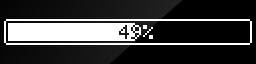
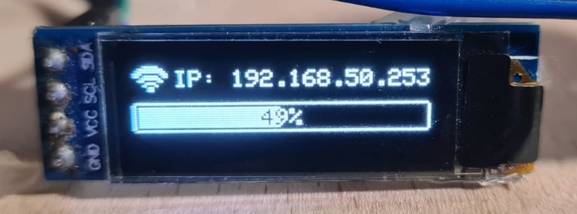
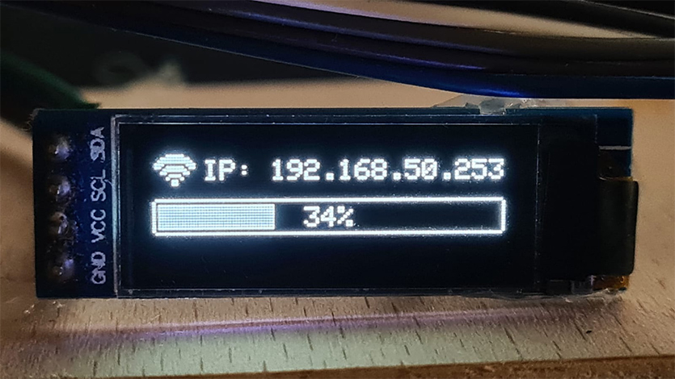

# AdafruitSSD1306 progress bar

Simple progress bar for 128x32 and 128x64 OLED displays using Adafruit_SSD1306 driver.

This example uses AdafruitSSD1306 driver, but it will work with virtually any driver out there.

Please refer to the documentation.

 

Example usage:

 

 

